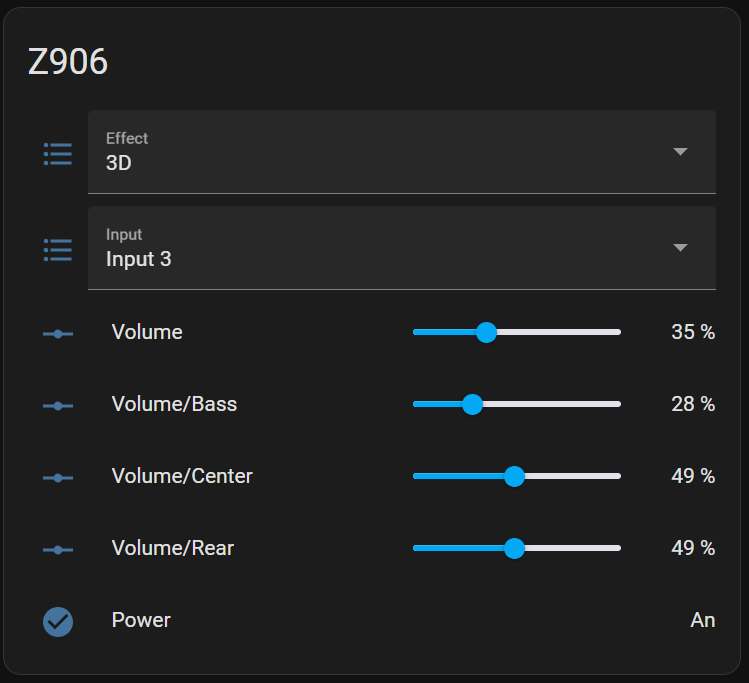
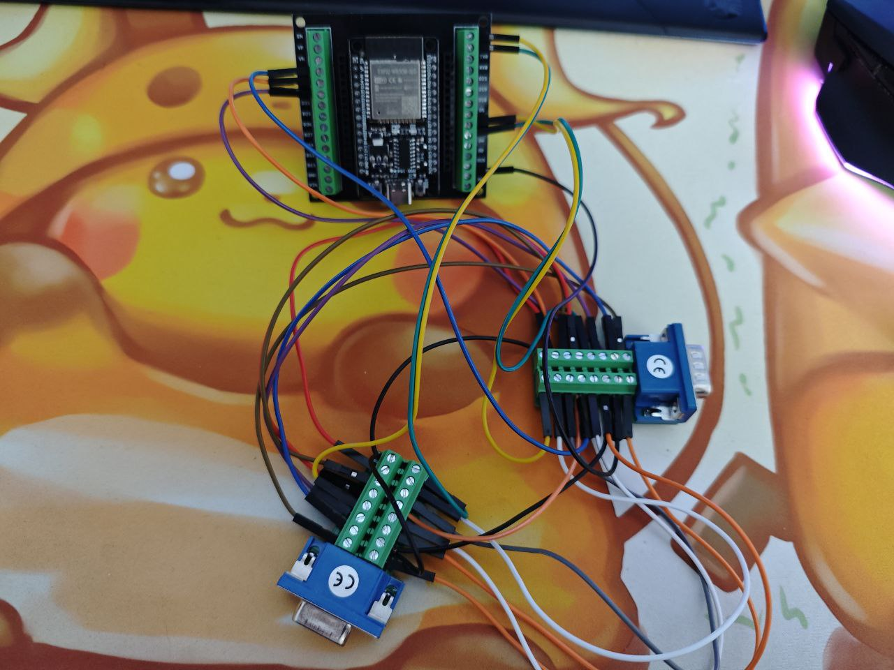
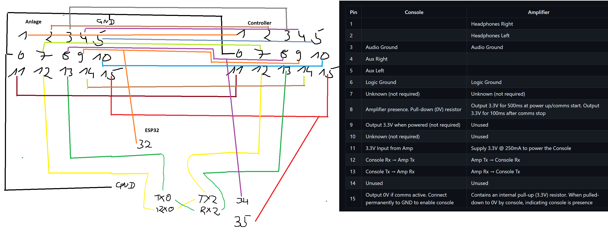

# Logitech Z906 WiFi Home Assistant Mod with Console Integration



This project provides a way to control your Logitech Z906 speaker system via WiFi using an ESP32 microcontroller. It includes MQTT integration for seamless control through Home Assistant.

I am aware that there are already multiple projects for this Sound System, but none of them integrated the original Z906 Console.
With this Project you can still use your Console for the System.

This project is perfect for everybody whos IR Receiver stopped working (like mine).

## Features

- Control volume, input, effects, and individual levels of the Z906 system
- Power on/off the Z906 system
- Home Assistant integration using MQTT and auto-discovery
- Still use the Z906 Console instead of replacing it
- Visual Feedback for all MQTT-Commands on the Console

## Hardware Requirements

- ESP32 microcontroller
- Logitech Z906 speaker system
- WiFi network
- DB15 Female Breakout Board
- DB15 Male Breakout Board

## Software Requirements

- Arduino IDE
- ESP32 board support for Arduino IDE
- Home Assistant
- Mosquitto MQTT broker

## Installation

1. **Clone this repository:**
   ```sh
   git clone https://github.com/Jupsi/logi_z906_wifi.git
   cd logi_z906_wifi/sketch_jun7a
   ```
2. **Install the necessary libraries in the Arduino IDE:**
   - PubSubClient
   - ArduinoJson

3. **Open the project in Arduino IDE:**
   - Open `sketch_jun7a.ino` in Arduino IDE.

4. **Update WiFi and MQTT settings:**
   - In `WifiSetup.cpp`, update your WiFi credentials.
   - In `sketch_jun7a.ino`, update your MQTT broker credentials in the setup method.

5. **Flash the ESP32:**
   - Connect your ESP32 to the computer.
   - Select the correct board and port in the Arduino IDE.
   - Click "Upload" to flash the ESP32.

6. **Configure Home Assistant:**
   - Ensure Mosquitto broker is installed and running in Home Assistant.
   - The auto-discovery feature should automatically add the Z906 entities to Home Assistant.

## Cable Connections

Below is the table showing the cable connections between the Console, Amplifier, and ESP32:




| Console | Amplifier | ESP32  |
|---------|-----------|--------|
| 1       | 1         | X      |
| 2       | 2         | X      |
| 3       | 3         | X      |
| 4       | 4         | X      |
| 5       | 5         | X      |
| 6       | 6         | Gnd    |
| X       | 6+Gnd     | X      |
| 7       | 7         | X      |
| 8       | 8         | 32     |
| 9       | 9         | 34     |
| 10      | 10        | X      |
| 11      | 11        | X      |
| 12      | X         | 17     |
| 13      | X         | 16     |
| X       | 12        | 22     |
| X       | 13        | 23     |
| 14      | 14        | X      |
| 15      | 15        | 35     |
| Gnd     | Gnd       | Gnd    |

You can adjust all ESP32 Headers in the z906.h file.
```
//esp GPIO Header
  const int ADC_PIN_LOW = 35;
  const int ADC_PIN_CON_BOOT = 32;
  const int ADC_PIN_CABLE_CONNECTED = 34;
  const int8_t RX_CONSOLE_GPIO = 16;
  const int8_t TX_CONSOLE_GPIO = 17;
  const int8_t RX_AMP_GPIO = 22;
  const int8_t TX_AMP_GPIO = 23;
```

## Known Issues
- When restarting the Console with the dedicated Button, there will arrive garbage Data on the Serial Lines. This confuses the Console and you have to unplug and replug it. I tried to fix that with integrated Pin 15 and Pin 8 but its not working properly.
- Mute is mostly tracked by Console so i could not integrate it into Home Assistant and provide full functionality.

## Troubleshooting
- Console is switching Inputs and/or Effect on its own
    1. Switch the Console off with the dedicated Power button.
    2. Wait atleast 5 seconds to assure the Console shut donw completly.
    3. Press Input for 8 Seconds and wait for 4 Input lights to light up.
    4. Config is reset to default.


- Console won't start
    1. Unplug the Console from ESP32.
    2. Restart ESP32.
    3. Wait ~ 10 seconds for ESP32 to startet completly.
    4. Replug the Console.

- Console auto shuts off
    1. Turn on the Console.
    2. Press Level for 5 Seconds until the Level lights shut off.


## License
This project is licensed under the GNU General Public License v3.0 (GPL-3.0). You are free to use, modify, and distribute the code, provided it is not for commercial purposes.

## Contribution
Contributions are welcome! Please open an issue or submit a pull request if you have any improvements or bug fixes.

## Support
For any questions or support, please open an issue in this repository.

## Special Thanks
- https://github.com/nomis for reverse Engineering this System
